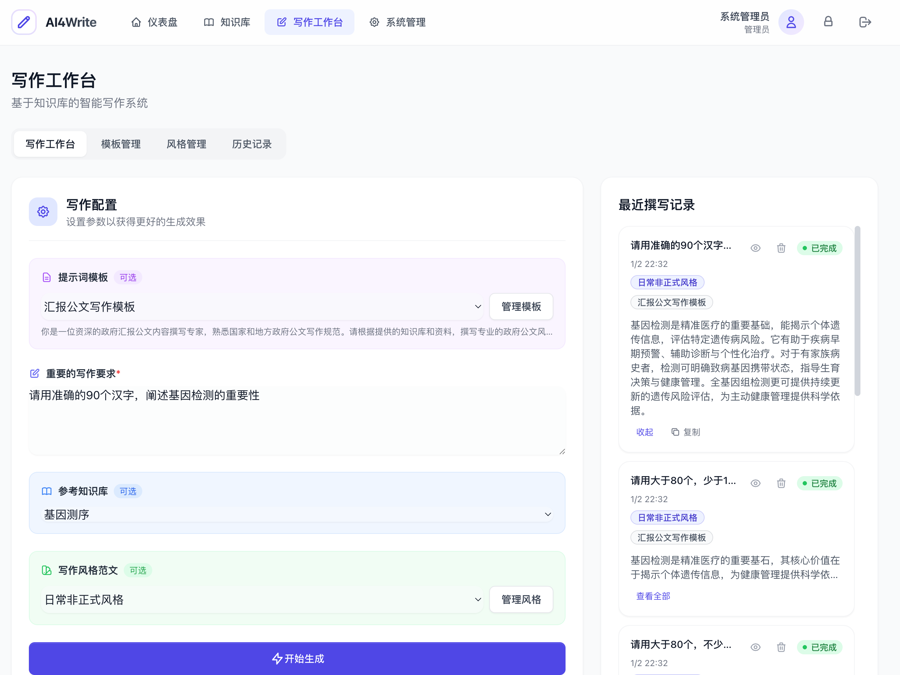

# AI4Write

<div align="center">


**Local RAG-based Intelligent Writing System**

[English](./README_EN.md) | [简体中文](./README.md)



</div>

---

## ✨ Features

- **📚 Knowledge Base Management** - Upload Word/TXT documents, automatically convert to Markdown and store with vector embeddings
- **✍️ Intelligent Writing** - Generate high-quality content using LLM based on knowledge base context
- **🎨 Templates & Styles** - Custom prompt templates and writing styles for flexible output control
- **🔒 Local Deployment** - Fully local operation with complete data control
- **👥 Multi-user Support** - Role-based access control (RBAC) for team collaboration

## 🏗️ Architecture

```
┌─────────────────────────────────────────────────────────────────┐
│                        Frontend (Nuxt 3)                         │
│  ┌───────────┐  ┌───────────┐  ┌───────────┐  ┌─────────────┐   │
│  │  Pinia    │  │ Tailwind  │  │  Vue 3    │  │  Components │   │
│  └───────────┘  └───────────┘  └───────────┘  └─────────────┘   │
└─────────────────────────────────────────────────────────────────┘
                              │
                              ▼
┌─────────────────────────────────────────────────────────────────┐
│                       Backend (Express + TypeScript)             │
│  ┌───────────┐  ┌───────────┐  ┌───────────┐  ┌─────────────┐   │
│  │  Prisma   │  │  JWT Auth │  │  Jobs     │  │  API Routes │   │
│  └───────────┘  └───────────┘  └───────────┘  └─────────────┘   │
└─────────────────────────────────────────────────────────────────┘
                              │
         ┌────────────────────┼────────────────────┐
         ▼                    ▼                    ▼
┌──────────────┐    ┌──────────────────┐    ┌──────────────┐
│   PostgreSQL │    │      MinIO       │    │  bge-m3 API  │
│  (pgvector)  │    │   File Storage   │    │  Embeddings  │
└──────────────┘    └──────────────────┘    └──────────────┘
```

### Tech Stack

| Layer | Technology |
|-------|------------|
| Frontend | Nuxt 3 + Vue 3 (Composition API) |
| State Management | Pinia |
| UI Styling | Tailwind CSS |
| Backend | Express + TypeScript |
| ORM | Prisma |
| Vector Database | PostgreSQL + pgvector |
| Object Storage | MinIO |
| Text Embedding | BGE-M3 |
| LLM | DeepSeek (OpenAI-compatible API) |

## 🚀 Quick Start

### Prerequisites

- Node.js >= 18
- PostgreSQL >= 14 (with pgvector extension)
- MinIO (object storage)
- DeepSeek API Key (optional for local deployment)

### Installation

1. **Clone the repository**

```bash
git clone https://github.com/yourusername/ai4write.git
cd ai4write
```

2. **Install dependencies**

```bash
# Install frontend dependencies
cd frontend && npm install

# Install backend dependencies
cd ../backend && npm install
```

3. **Configure environment variables**

```bash
# Backend configuration
cp backend/.env.example backend/.env
# Edit .env with database connection, MinIO, API keys, etc.
```

4. **Initialize database**

```bash
cd backend
npx prisma generate
npx prisma db push
npm run seed  # Optional: seed test data
```

5. **Start services**

```bash
# Start backend (port 3001)
npm run dev:backend

# In a new terminal, start frontend (port 3000)
cd frontend && npm run dev:frontend
```

6. **Access the application**

Open browser to http://localhost:3000

### Default Accounts

| Email | Password | Role |
|-------|----------|------|
| admin@ai4write.local | admin123 | Administrator |
| test@ai4write.local | user123 | Regular User |

## 📁 Project Structure

```
ai4write/
├── frontend/                 # Nuxt 3 frontend project
│   ├── assets/css/          # Global styles
│   ├── components/          # Vue components
│   ├── layouts/            # Page layouts
│   ├── pages/              # Page routes
│   ├── stores/             # Pinia stores
│   ├── composables/        # Composable functions
│   └── nuxt.config.ts      # Nuxt configuration
│
├── backend/                 # Express backend project
│   ├── src/
│   │   ├── controllers/    # Controllers
│   │   ├── routes/         # API routes
│   │   ├── services/       # Business logic
│   │   ├── middleware/     # Middleware
│   │   └── prisma/         # Prisma schema
│   └── prisma/             # Database migrations
│
└── README.md               # Project documentation
```

## 🔧 Configuration

### Docker Deployment

Deploy with Docker Compose (includes Nginx reverse proxy):

```bash
# Enter docker directory
cd docker

# Copy and configure environment variables
cp .env.example .env
# Edit .env with database connection, MinIO, API keys, etc.

# Build and start all services
docker-compose up -d --build

# View logs
docker-compose logs -f
```

After deployment, access the application at `http://YOUR_DOMAIN:8089`.

#### Architecture Overview

```
                    ┌─────────────────┐
                    │     Nginx       │
                    │   (Port 8089)   │
                    └────────┬────────┘
                             │
              ┌──────────────┴──────────────┐
              │                             │
              ▼                             ▼
    ┌─────────────────┐          ┌─────────────────┐
    │    Frontend     │          │     Backend     │
    │  (Nuxt 3:3000)  │          │ (Express:3001)  │
    └─────────────────┘          └─────────────────┘
```

- **Nginx** - Unified entry point, reverse proxy for frontend and backend
  - `/` → Frontend (Nuxt 3)
  - `/api/*` → Backend API (Express)
- **Frontend** - Nuxt 3 SSR application
- **Backend** - Express API service

> **Note**: Current Docker configuration assumes PostgreSQL, MinIO, Redis, and other infrastructure services are running externally.

### Environment Variables

Create a `.env` file in the `docker` directory:

```env
# Node Environment
NODE_ENV=production

# ===========================================
# External Service Ports
# ===========================================
PROXY_PORT=8089            # Nginx proxy port (unified entry)

# ===========================================
# PostgreSQL (External Service)
# ===========================================
POSTGRES_HOST=your-db-host
POSTGRES_PORT=5432
POSTGRES_USER=ai4write
POSTGRES_PASSWORD=your_password
POSTGRES_DB=ai4write

# ===========================================
# MinIO (Object Storage)
# ===========================================
MINIO_ENDPOINT=your-minio-host
MINIO_PORT=9000
MINIO_USE_SSL=false
MINIO_ACCESS_KEY=minioadmin
MINIO_SECRET_KEY=minioadmin
MINIO_BUCKET=ai4write

# ===========================================
# Redis (External Service)
# ===========================================
REDIS_HOST=your-redis-host
REDIS_PORT=6379
REDIS_URL=redis://:password@your-redis-host:6379/0

# ===========================================
# Embedding API (Vector Service)
# ===========================================
EMBEDDING_API_URL=http://your-embedding-host:8000/v1/embeddings
EMBEDDING_MODEL=text-embedding-bge-m3

# ===========================================
# DeepSeek/LLM API
# ===========================================
DEEPSEEK_BASE_URL=https://api.deepseek.com
DEEPSEEK_API_KEY=sk-xxx
DEEPSEEK_MODEL=deepseek-chat

# ===========================================
# JWT Configuration
# ===========================================
JWT_SECRET=your-super-secret-jwt-key
JWT_EXPIRES_IN=7d

# ===========================================
# Frontend API URL
# ===========================================
# When using Nginx reverse proxy, set to empty or relative path
NUXT_PUBLIC_API_BASE_URL=
```

## 📖 User Guide

### 1. Create Knowledge Base

1. Navigate to "Knowledge Base" page
2. Click "New Knowledge Base" to create a category Word/TXT documents
3. Upload or paste text directly
4. System automatically parses, vectorizes and stores content

### 2. Start Writing

1. Navigate to "Writing Workspace"
2. Select a prompt template (optional)
3. Enter your writing requirements
4. Select reference knowledge base (optional)
5. Select writing style (optional)
6. Click "Start Generation"

### 3. Manage Templates

Switch to "Template Management" or "Style Management" tabs in "Writing Workspace":

- Create/edit/delete prompt templates
- Manage writing style examples
- Organize templates by categories

## 🛠️ Development Guide

### Adding New Features

```bash
# 1. Add backend API
backend/src/routes/api.ts     # Add route
backend/src/services/user.ts  # Add business logic

# 2. Add frontend page
frontend/pages/admin.vue      # New page
frontend/components/MyComponent.vue  # New component
```

### Database Migrations

```bash
# Create migration
npx prisma migrate dev --name add_user_field

# Deploy migration
npx prisma migrate deploy
```

## 🤝 Contributing

Issues and Pull Requests are welcome!

1. Fork this repository
2. Create a feature branch (`git checkout -b feature/AmazingFeature`)
3. Commit your changes (`git commit -m 'Add some AmazingFeature'`)
4. Push to the branch (`git push origin feature/AmazingFeature`)
5. Create a Pull Request

## 📄 License

This project is licensed under the MIT License - see [LICENSE](LICENSE) file for details.

## 🙏 Acknowledgments

- [Nuxt.js](https://nuxt.com/) - The Vue.js Framework
- [Tailwind CSS](https://tailwindcss.com/) - CSS Framework
- [DeepSeek](https://deepseek.com/) - Large Language Model
- [BGE-M3](https://github.com/FlagOpen/FlagEmbedding) - Embedding Model

---

<div align="center">

**If you find this project helpful, please ⭐ Star to show your support!**

</div>
